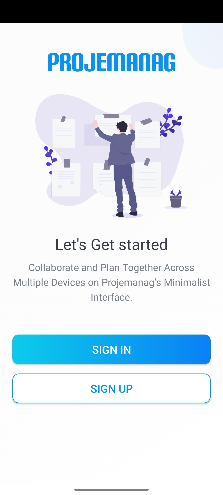
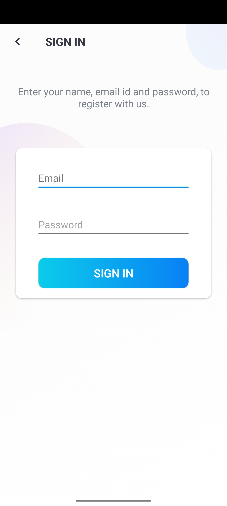
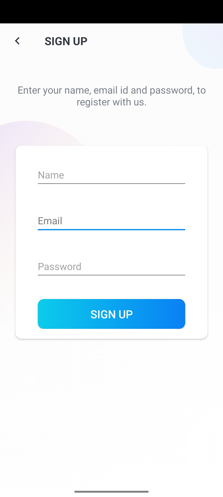
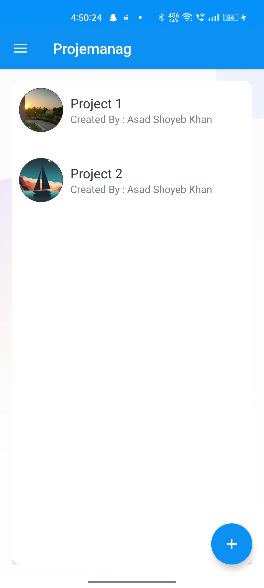
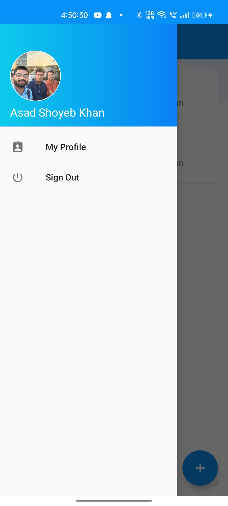
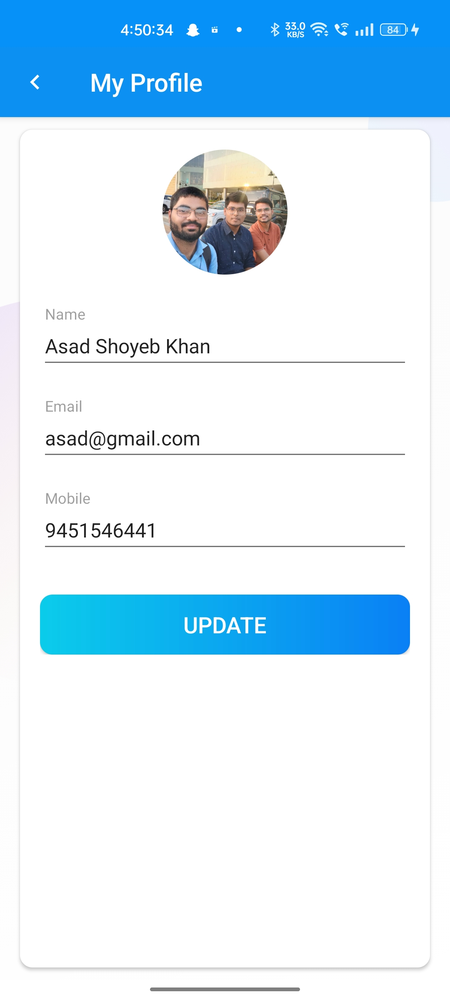
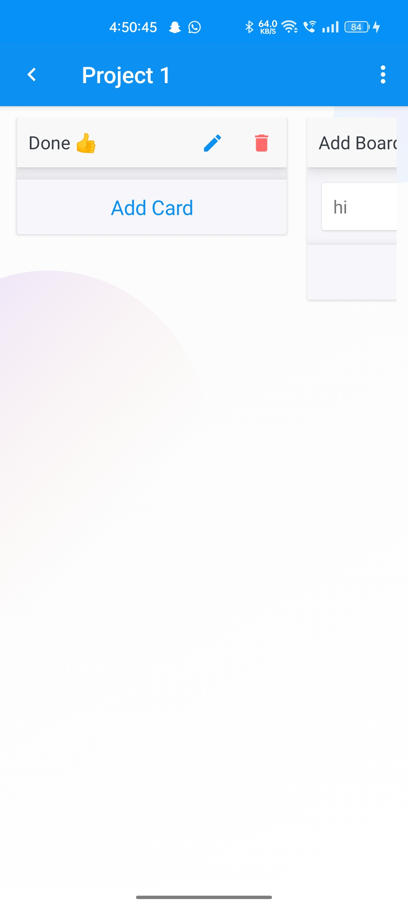

# Project Name

## Description

[Include a brief description of your project here.]

## Demo Video

Here's a video demonstrating how the project works:  

## Screenshots

## Features

- Create new projects
- Add tasks and assign them to team members
- Set deadlines for tasks
- Collaborate with team members on projects
- Chat feature to communicate with team members
- Attach files and documents to projects

## Installation

1. Clone the repository to your local machine.
2. Open the project in Android Studio.
3. Build the project and run it on your device or emulator.

## Usage

1. Create a new account or login to an existing account.
2. Create a new project and add team members to it.
3. Add tasks to the project and assign them to team members.
4. Set deadlines for tasks.
5. Collaborate with team members using the chat feature.
6. Attach files and documents to the project for reference.

## Contributing

Contributions are welcome! If you find any bugs or have feature requests, please open an issue on the GitHub repository.

## License

[Include the license information for your project here, if applicable.]

## Support

[Include contact or support information, if applicable.]

